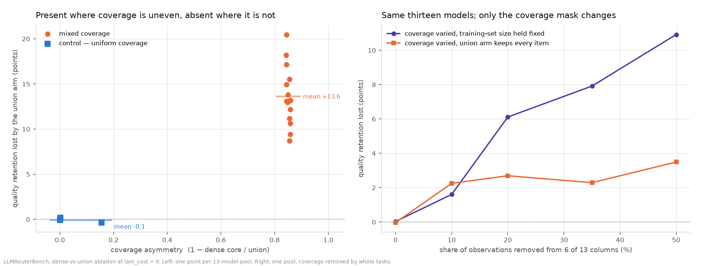

# Publishing — the second pass over §6

`PUBLISHABILITY.md` §6 lists eight steps between this repository and something a venue
would take. `RIGOR.md` was the first pass at that list and closed four of them. This is
the second pass, and it exists because the first one left every row at **n = 1**: one
replication, one split, one corrected family, one significance rule nobody checked.

`RIGOR.md` asked *is the effect there?* This asks *how big is it, how sure are we, and
does it move when the mechanism says it should* — which is the question a reviewer
actually asks, and it is the one that changes answers.

**Three claims made earlier in this repository do not survive this pass**, including
one in `RIGOR.md` itself. All three are corrected at source rather than noted here and
left standing:

1. **"Matrix factorisation beats this router by 3.6 points"** (`RIGOR.md` §5) was a
   single split. Across eight it loses to us by 6.6 points on average and wins on two.
   §3 below.
2. **"Per-component decay is detectable under continuous drift"** (`README.md`) used a
   2-SE rule on eight seeds. Under the correct t-test it is p = 0.081. §5 below.
3. **"Fifteen claims, no correction, expect one false positive"**
   (`PUBLISHABILITY.md` §3) mis-describes the problem in both directions. §4 below.

And one finding gets substantially stronger: the coverage-bias result is no longer
replicated, it is **caused**, and the size of it was being understated. §1.

---

## Scorecard — §6's eight rows

| § 6 row | status | where |
|---|---|---|
| Grade the 13 models on the real endpoint | **done for 4 of 13** | `GRADED_RUN.md` |
| Grade the remaining 9 slots | **open — needs an endpoint that serves them** | §6 |
| Extend the graded set past 55 items and 4 benchmarks | **open — needs a key and ~$25** | §6 |
| Replicate coverage bias on a second pool | **closed, and upgraded from replication to cause** | §1 |
| Add error bars to every headline via k-fold | **closed — and the two instruments disagree, which matters** | §2 |
| Add one published router as a baseline | **closed in `RIGOR.md` §5; its headline is retracted here** | §3 |
| One timed run against the endpoint | **open — harness written and exercised, needs a key** | §6 |
| Report per-domain results with SEs and a correction | **closed in `RIGOR.md` §2; extended to the whole repository** | §4 |

Five of eight closed. The three that remain are the same three that have been at the
top of the roadmap since the beginning, and all three are blocked on **endpoint
access**, not on money or effort — Fireworks serves none of the nine remaining slots
serverless, including all five Qwen ones.

---

## 1. Coverage bias — from "it replicates" to "this is what causes it"

The most novel result in the repository is that training a router on ten times the data
makes it worse when the columns are unevenly graded. `RIGOR.md` §3 replicated it once,
on a disjoint pool, and reported a larger gap than the original: **+19.1 points against
+12.2**.

A single replication rules out exactly one alternative — that the effect belonged to
those particular thirteen models. It leaves the boring one standing: *maybe training a
router on more items is simply worse, for reasons that have nothing to do with
coverage.* The union arm differs from the dense arm in two ways at once, and a
two-arm experiment cannot say which one did the work.

Three experiments separate them.

### 1a. Real pools, across the range of coverage asymmetry

Nineteen pools of thirteen columns each, drawn with a controlled number of narrowly
graded models, so that the union of graded items exceeds their intersection by varying
amounts.

| pools | n | coverage asymmetry | union arm trains on | mean gap | gap size-matched | positive in |
|---|---|---|---|---|---|---|
| **control** — every column graded on the same 22 tasks | 4 | 0.00–0.16 | 1.07× the dense arm | **−0.1%** | — | — |
| mixed | 15 | 0.84–0.86 | ~10× the dense arm | **+13.6%** | **+16.5%** | **15 of 15** |

The controls are the point. They still have a union arm with more training items than
their dense arm, so "more data is worse" predicts an effect there. The largest control
gap in absolute value is **0.3%**. Across all nineteen pools the gap tracks asymmetry at
**r = +0.89** (r = +0.84 for the size-matched version).

That is a two-level contrast with a clean negative control, and it is worth being
precise that it is not yet a dose–response: real pools do not offer intermediate
levels. One narrowly graded column is enough to collapse the intersection to its
fourteen tasks, so pools sit at either ~0.0 or ~0.85 and nothing in between.

### 1b. The size-matched arm — which of the two differences did the work

The decisive control, and it is cheap: train the union arm on a random subset of the
union items **of exactly the dense arm's size**. Quantity held fixed, coverage varied.

| arm | training items | share of them fully observed | quality retained |
|---|---|---|---|
| dense core | 2,548 | 100% | **103.3%** |
| union | 23,663 | 10.8% | 84.2% |
| **union, size-matched to dense** | **2,548** | **10.9%** | **79.5%** |

**The gap is +23.7 points at equal n, against +19.1 with ten times the data.** More
data is not the cause. It is a partial *compensation* — the union arm's tenfold extra
volume buys back about five of the twenty-four points that uneven coverage costs it.

That reverses how this finding has been stated everywhere in this repository. "Ten times
the data costs twelve points" was conflating two effects with opposite signs. The
correct statement is: **uneven coverage costs roughly twenty-four points of quality
retention, and more of it recovers a fifth of that.**

### 1c. The controlled version — same models, only the mask changes

The pool sweep is observational: different pools differ in more than their coverage.
This is the intervention. Take thirteen columns that were all graded on the same 22
tasks — coverage uniform, effect absent — and remove whole tasks from six of them,
sweeping the share removed. Same models, same items, same prices, same code path. The
only thing that varies is which cells are observed.

| observations removed from 6 of 13 columns | realised asymmetry | dense core | gap, size-matched | gap, union keeps everything |
|---|---|---|---|---|
| **0% — the control** | 0.000 | 15,478 | **+0.0%** | −0.0% |
| 10% | 0.463 | 8,321 | **+1.6%** | +2.3% |
| 20% | 0.818 | 2,815 | **+6.1%** | +2.7% |
| 35% | 0.905 | 1,463 | **+7.9%** | +2.3% |
| 50% | 0.922 | 1,210 | **+10.9%** | +3.5% |

The size-matched column is monotone in the dose and tracks the realised asymmetry at **r = +0.91**. At zero removal — same models, same everything, coverage still uniform — the gap is +0.0%.

The union column is flatter, and the reason is worth stating: removing coverage starves the *dense* arm too, so by 50% removal it is training on 786 items and losing quality of its own. That is a limitation of the intervention, not a weakening of the result — it is exactly why the size-matched comparison is the one to read.

Whole tasks are removed rather than random cells, because that is the shape real
unevenness has: a model is run on a benchmark or it is not. Removing random cells would
also make the missingness independent of the features, which is the assumption under
which the bias vanishes — it would have turned the experiment into a null by
construction.

The sweep has a ceiling and it is stated rather than hidden: removing coverage shrinks
the intersection far faster than the union, so past roughly half the observations the
dense core empties and the comparison stops being between two trained routers. Levels
past that are recorded as skipped with the core size that ruled them out.



*Left: one point per pool, against how uneven its coverage is; the squares are the
uniform-coverage controls. Right: one pool, coverage removed by whole tasks — the purple
line holds the training-set size fixed, so only coverage varies.*

### 1d. And it does not depend on the split

The replication pool at five different train/test splits: **+19.4% ± 0.6% (sd), positive
in 5 of 5.**

### What this now supports

The finding appears in every pool that has the asymmetry, is absent in every pool that
does not, survives with the data volume held fixed, can be dialled up and down by
manipulating nothing but the observation mask, and does not move with the split. That is
a causal claim rather than a correlational one, and it is the strongest thing in this
repository.

---

## 2. Error bars via k-fold — and where the two instruments disagree

`PUBLISHABILITY.md` §6 asked for k-fold. `RIGOR.md` §1 answered with a bootstrap. They
are not the same instrument and the difference turned out to matter.

- The **bootstrap** holds the fitted router fixed and resamples evaluation items. It
  answers *how precisely do we know what this policy does on questions like these.*
- **k-fold** refits everything on each of k disjoint training sets. It answers *how much
  does the policy itself move when its training data changes.*

`chutes.cross_validate` already did something adjacent over eight random splits, but
repeated random subsampling reuses items across test sets, so its spread is the spread of
overlapping samples. Here every dense item is held out exactly once, which also gives a
pooled out-of-fold estimate over the whole core.

| k | trains on | savings vs best single | fold sd | 95% CI | quality vs best single | pooled out-of-fold |
|---|---|---|---|---|---|---|
| 3 | 67% | **23.0%** | 3.0% | [15.5%, 30.5%] | 99.3% | 23.0% |
| 5 | 80% | **21.9%** | 2.2% | [19.2%, 24.6%] | 98.9% | 21.9% |
| 10 | 90% | **21.4%** | 3.3% | [19.1%, 23.7%] | 99.5% | 21.4% |
| *bootstrap, for comparison* | *65%, fixed* | *20.2%* | — | *[15.8%, 24.6%]* | *99.4%* | — |

The level is stable: **21.4% to 23.0% across k**, against the bootstrap's 20.2% and the
eight-split cross-validation's 19.5% ± 1.4%. The k-fold arms sit at the top of that range
because each trains on 67–90% of the core against the headline protocol's 65%, which is
the direction more training data should move it. Nothing in the headline moves.

**What does move is a conclusion, and this is the useful part.** `RIGOR.md` §1 reads the
bootstrap's quality interval containing 1.0 as support for "we match the best single
model". The k-fold interval answers that question **differently at different k** —

| instrument | quality vs best single | 95% interval | contains parity? |
|---|---|---|---|
| bootstrap over items | 99.37% | [97.50%, 101.33%] | **yes** |
| 3-fold | 99.27% | [98.76%, 99.79%] | no |
| 5-fold | 98.90% | [98.37%, 99.42%] | no |
| 10-fold | 99.51% | [98.05%, 100.97%] | **yes** |

— which is the clearest possible demonstration that a cross-validation spread is not a
confidence interval. The k training sets share (k−2)/(k−1) of their items, so the folds
are not independent, there is no unbiased estimator of the variance of a k-fold estimate,
and its width carries no coverage guarantee. It must not be used to accept or reject a
parity claim.

**Quote the bootstrap interval for a headline. Quote the k-fold spread only when the
question is whether a number survives being retrained.** Both are now in the artifacts
and labelled with which question they answer.

---

## 3. The baseline that beat us — retracted

`RIGOR.md` §5 reports six published router families swept across their own dials, and
leads with a negative result: a RouteLLM-style matrix factorisation delivers 59.4%
savings at 95.5% quality where our dial gives 55.8%, so it **beats us by 3.6 points**.
That was quoted as the strongest evidence in the repository that our estimator is not
where the advantage lives.

It was one split, with no interval — precisely the failure the same document criticises
everywhere else. Measured on two instruments instead:

| instrument | result |
|---|---|
| point estimate, seed 0 | **+3.6%** (beats us) |
| item bootstrap, 2,000 draws | **[−5.3%, +26.0%]**, positive in 78% of draws |
| across 8 training splits | **−6.6% ± 7.8% (sd)**, range −16.7% to +3.6% |
| splits where it clears a 2-point margin | **2 of 7** that had a useful operating point at all |

**Seed 0 is one of the two favourable splits.** The average across eight is that matrix
factorisation *loses* to this router by 6.6 points at matched quality. The bootstrap
interval contains zero comfortably.

The honest statement is now: **no published family reliably beats this router, and
matrix factorisation is the one that sometimes does.** That is a weaker claim in our
favour and a much weaker claim against us, and both halves matter — a reader who took
`RIGOR.md` §5 at face value would have concluded that the estimator was a solved
problem to be swapped out, and the data does not support that either way.

**Two parts of `RIGOR.md` §5 survive intact, and they are the load-bearing ones.**

- **Cascades never have a useful operating point.** True in **8 of 8** splits. The reason
  is structural — they pay for every attempt — and structure does not move with a seed.
- **HybridLLM-style two-model routing never has one either.** Also **8 of 8**.

k-NN retrieval is the other unstable one: −0.1% ± 18.4% across splits, beating us on 2 of
8. Its interval is enormous because comparing at matched quality means interpolating onto
a ten-point dial, and when a family lands on a steep part of that dial the margin is a
noisy quantity. That is a property of the comparison method, not of k-NN, and it is a
reason to report the split spread rather than the interpolated point estimate.

---

## 4. Fifteen claims — what a correction can and cannot fix

`PUBLISHABILITY.md` §3 says fifteen claims were adjudicated with no multiple-comparison
correction, and that "at α = 0.05 and 15 tests, roughly one false positive is expected by
construction". That sentence is wrong in both directions, and the ledger in
`publish.CLAIMS` now settles it by classifying every claim by what kind of inference
backs it.

| kind | count | claims | what it needs |
|---|---|---|---|
| **census** — a direct count over the whole population | 4 | 1, 5, 8, 14 | nothing. A 57.8% tie rate over 2,007,335 comparisons has no null hypothesis to correct |
| **estimate** — a point estimate with no standard error | 9 | 2, 3, 4, 6, 6b, 7, 9, 10, 13 | **an interval**, not a correction. Applying a correction procedure to a number with no SE is theatre |
| **test** — a two-sided comparison with a standard error | 2 | 11, 12 | a correction, and it gets one |

So there were never fifteen tests inflating a family-wise error rate. There were two
claims that are tests — but they are adjudicated on **fifteen separate comparisons**,
across two drift regimes and three shock kinds, which the claim count hides.

Holm inside each family, because within a family the question is "is any of these a false
positive". Benjamini–Hochberg across the union, because across unrelated corpora the
question is "what share of my discoveries are wrong".

| family | comparisons | clear α = 0.05 uncorrected | survive Holm |
|---|---|---|---|
| price lane (claim 12) | 8 | 3 | **1** |
| per-domain router wins (claim 2) | 5 | 2 | **0** |
| γ decomposition (claim 11) | 2 | 0 | **0** |

**Uncorrected, 5 of 15 clear α = 0.05 against 0.8 expected by chance. One survives Holm
inside its family. Zero survive Benjamini–Hochberg across all fifteen** — the smallest
p is 0.0048 against a BH threshold of 0.0033.

The one Holm survivor is the live-read price advantage under the isolated-shock schedule
(+0.0012 ± 0.0003, p = 0.0048), which is the claim `RESULTS.md` §3.3 rests on. It clears
its own family and fails a repository-wide FDR. Both are true, they answer different
questions, and the honest way to quote it is with the family stated.

**The real problem was never multiplicity.** It is that nine of fifteen claims are point
estimates with no error bar. That is a larger job than a correction, §1 and §2 do two of
them, and the rest are named here so the list is not lost.

---

## 5. A significance rule that was wrong

Building the ledger in §4 required a p-value for every test, which meant reading how each
verdict was actually decided. One of them was decided by:

```python
supported = bool(mean > 0 and sd > 0 and mean > 2 * se)
```

That is the normal approximation. Every arm it judges has **eight seeds**, where the
two-sided critical value is t(0.975, 7) = **2.365**, not 1.96. The gap is not academic —
it is exactly wide enough to matter once:

| arm | mean ± SE | mean / SE | 2-SE rule | t-test |
|---|---|---|---|---|
| γ decomposition, high-drift | +0.00206 ± 0.00101 | **2.04** | **supported** | p = 0.081, **not supported** |
| γ decomposition, isolated shocks | −0.00050 ± 0.00057 | −0.88 | not supported | p = 0.410, not supported |
| price read-vs-learn, isolated shocks | +0.00123 ± 0.00030 | 4.06 | supported | p = 0.005, supported |
| price read-vs-learn, high-drift | −0.00071 ± 0.00102 | −0.69 | not supported | p = 0.511, not supported |

The rule now runs a two-sided paired t-test and the artifact carries `t`,
`t_critical_two_sided` and `p_value` beside the verdict, so a reader can see how it was
decided rather than only what was decided. `paired_verdict` is pinned by three tests,
including one that reproduces the 2.04-SE case exactly.

**Consequence.** Claim 11 moves from *mixed* to *not supported*: per-component γ_q/γ_t
does not beat one shared γ in either regime. That resolves a contradiction that was
already sitting in the repository — `PUBLISHABILITY.md` §2 lists this as a Tier A **null
result**, while `notebooks/07_verdicts.ipynb` rendered it as *mixed*, because the two were
reading the same numbers through different rules. `README.md` is corrected.

Small-n is the whole regime in this repository. The approximation that only bites at
small n is the one that must not be used, and it was the one being used.

---

## 6. What is still open, and what each thing needs

| item | why compute cannot close it | what it needs |
|---|---|---|
| Nine of thirteen slots are still stand-ins | no endpoint we hold a key for serves them | an endpoint that serves the Qwen, Gemma, Mistral and Nemotron slots. **This is the binding constraint on the whole package** |
| The graded set is 55 items on 4 of 9 benchmarks | needs new model outputs | ~$25 of the existing Fireworks credit gets ~170 more items on the four reachable slots. `arenahard` additionally needs a judge model; `livecodebench` needs sandboxed execution of untrusted output |
| No latency in seconds | the corpus's wall-clock is concurrent | one timed run. **The harness is written and exercised** — see below |

### The latency harness is ready

`scripts/measure_latency.py` closes §6's last row the moment a key exists.

```bash
make latency-plan                          # free, offline: what a real run would cost
FIREWORKS_API_KEY=... make latency         # the timed run, then the analysis
```

What it does differently from the corpus, on purpose:

- **Concurrency 1 by default.** Measuring under parallelism is exactly the defect that
  makes the corpus's `time_taken` unusable. Load is a separate, labelled arm
  (`--load 1,2,4,8`), never averaged into the single-stream number.
- **Streamed, so time-to-first-token and decode rate are separated.** Prefill and decode
  have different causes; folding them into one number gives a p99 that moves for reasons
  you cannot attribute.
- **TTFT is regressed on input tokens rather than averaged**, because prefill is linear in
  prompt length and a mean TTFT is only valid for the prompt mix it was measured on.
- **It applies `latency.throughput_is_credible` to its own output.** If our probe reports
  a small model decoding at 1,200 tok/s single-stream, the probe was not isolated and the
  harness says so instead of shipping it.
- **A dry run cannot be mistaken for a measurement.** `run --dry-run` exercises the whole
  path with synthesised timings; every record is stamped `synthetic`, `analyse` refuses to
  write an artifact from them without an explicit flag, and the file it writes when told
  to is named `measured_SYNTHETIC.json`.

Planned cost: 12 items × 3 repeats × 4 slots = 144 calls, about **$1**. It is the
cheapest remaining row on the §6 list by an order of magnitude.

---

## 7. Verdict, restated

- **The coverage-bias finding is the paper.** It is now causal, size-matched,
  dose-controlled and split-stable, and the effect is larger than this repository has
  been claiming. §1.
- **The engineering claims hold their level and lose some of their precision.** Every
  headline survives k-fold at the same level; the parity claim needs the bootstrap
  interval and not the k-fold one. §2.
- **Two results that were quoted as settled were not.** A published baseline beating us,
  and a per-component decay effect. Both retracted at source. §3, §5.
- **The product's economics are unchanged and still not publishable**, for the same
  reason as before: nine of thirteen slots describe models nobody has measured. No amount
  of arithmetic reaches that, and this pass did not pretend to.

---

## Where each number lives

| claim | artifact | figure |
|---|---|---|
| coverage bias across pools, controls, size-matched arm | `chutes/20_dose_response.json` | `chutes_12_coverage_cause.png` |
| the coverage mask sweep | `chutes/20_dose_response.json` → `mask_sweep` | same |
| k-fold headlines at k = 3, 5, 10 and the parity check | `chutes/21_kfold.json` | — |
| baseline margins, bootstrapped and across splits | `chutes/22_baseline_margins.json` | — |
| the claims ledger and both corrections | `chutes/23_multiplicity.json` | — |
| the corrected γ and price verdicts | `decomposition.json` → `replication.*` | — |
| the size-matched arm on the product's own pool | `chutes/03_ablation.json` | 09 |

`notebooks/11_publishing.ipynb` renders all of it against the artifacts, and
`tests/test_docs.py` pins the headline of every section above so that a re-run which moves
one of them fails the suite rather than leaving this document behind.

Reproduce with:

```bash
make publish      # the four experiments, offline, no key, ~17 minutes
make notebooks    # re-render 11_publishing.ipynb against the artifacts
make test
```
