# Results — what we measured, and how far it is from shippable

Written from `artifacts/` after a full run. Every figure here is traceable to a JSON file
and a notebook cell; nothing is estimated. Where a number is weaker than it looks, that is
said in the same sentence as the number.

Reproduce: `make data && make run` (RouterBench, ~15 min), then
`make chutes-data && make chutes` (Chutes pool, ~5 min), then `make notebooks`.
Every image below is written by that run — none are drawn by hand.

**How much weight each number bears is assessed separately.** `PUBLISHABILITY.md` grades
every finding by evidence tier; `RIGOR.md` then closes eight of its ten watch-list items —
bootstrap intervals on every headline, a family-wise correction that kills all five
per-domain claims, a replication of the coverage finding on a disjoint pool, and the
published-router baselines that were missing. Two of those corrections contradicted claims
made here, and both were fixed at source.

---

## 1. The one-paragraph version

Routing works on this pool, but by less than the headline number suggests, and the
binding constraint is not the one the product documents assume. Against the strongest
model — what a team does today — the router is **79.6% cheaper at 97.8% of its quality**.
Against the model that is *actually* the best single choice once price is counted, it is
**19.5% ± 1.4% cheaper at 98.6% ± 0.4%**. The second number is the honest one and it is
the one to defend. A 26-week replay run twice — on 2023 commercial models and again on the
current pool — shows a router that stops re-testing crosses below "no routing at all" in
**five and nine weeks** respectively, with **99% and 93%** of the decay coming from not
being able to pick models that shipped after training. That replication is the strongest
argument for the product, and the RouterBench half of it depends on no proxy assumption at
all. The largest piece of unclaimed value is elsewhere: two cheap slots the router never
selects are worth **30.8%** of traffic to a per-item oracle, and the thing blocking them is
prediction calibration, not the pool.

---

## 2. Two corpora, two questions

These are kept apart deliberately. Blending them would produce a flattering average that
answers neither question.

| | RouterBench | LLMRouterBench → Chutes pool |
|---|---|---|
| what it answers | does a router go stale, and what does that cost | what does routing *our* pool save today |
| models | 11 commercial, 2023 (GPT-4 Turbo, Claude v1/v2, Llama 2 …) | the 13 Chutes slots, stood in for by current models |
| items | 36,497 | 3,541 fully-observed, across 9 benchmarks |
| graded cells | 401,467 | 185,285 |
| release dates | **yes** — this is why it is still here | no |
| proxy-backed | no | **yes** — read §7 before quoting |

**Why the old models are still in the repo.** RouterBench is the only public label matrix
that carries release dates, and without dates there is no way to replay a pool that grows
over calendar time. That replay is the staleness result, and the staleness result is the
product's reason to exist. The 2023 models are not the routing engine — they are the only
available clock.

**The routing engine itself is entirely current.** The shipped policy
(`artifacts/chutes/router.npz`, 36 KB) is trained over the 13 Chutes models, and 11 of its
13 stand-ins are open-weights models of exactly the kind Chutes serves.

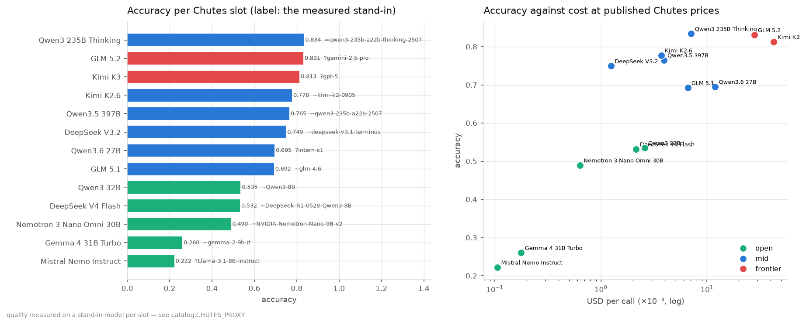

*Left: measured accuracy per slot, with the stand-in behind each one — `=` identical
checkpoint, `~` same family, `?` capability-matched only. Right: the same models against
cost at published Chutes prices, log scale. Accuracy runs **0.22 to 0.83** and realised
cost per call spans **404×** (list prices alone span 151×; the rest is that the stronger
models also write more). That spread is the entire opportunity — a pool where every model
cost the same would leave nothing to route between.*

---

## 3. Headline results

### 3.1 The Chutes pool — what routing is worth

Over 8 random splits at the calibrated dial (λ_c = 0.2), 1,239 held-out questions per split:

| against | cheaper by | quality kept |
|---|---|---|
| GLM 5.2 — the strongest model | **79.6% ± 0.3%** | 97.8% ± 0.4% |
| Qwen3 235B Thinking — the best *value* model | **19.5% ± 1.4%** | 98.6% ± 0.4% |

Both are reported everywhere in the code and on the website, in that order, because the
first is a softer target than it appears: GLM 5.2 is the highest-quality model in the pool
and is beaten outright on **both** axes by Qwen3 235B Thinking, which is cheaper and
scores higher. Savings measured against a model that another single model already
dominates are inflated by a gap the router had nothing to do with.

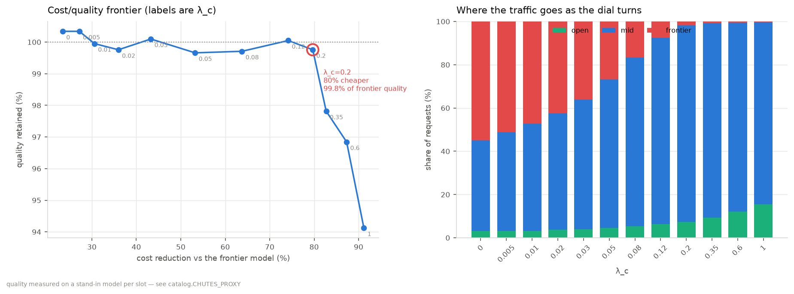

*Left: the whole frontier, labelled by λ_c — the product's cost/quality slider. Each point
names the quality it gave up to get there, which is the only way to state a savings figure
without cherry-picking. Right: where the traffic goes as the dial turns. At the calibrated
setting the router is spending mostly mid-tier and reaching for frontier models on 2% of
requests.*

### 3.2 The staleness result — the strongest evidence we have

26-week replay, pool growing on its real calendar. Now measured **twice, on two disjoint
pools two years apart in model generation** (2023 commercial models; 2024–25 open models),
which is the closest thing here to an independent replication.

| | RouterBench (2023 models) | Chutes pool (current) |
|---|---|---|
| pool grows | 5 → 11 models | 5 → 13 models |
| frozen router | +0.010 → **−1.012** | +0.127 → **−1.062** |
| rolling router | flat | +0.151 → −0.148 |
| crosses below "one good model" | week 5 | **week 9** |
| share of the gap from *new models* | **99%** | **93%** |
| share from *fresher data* | 1% | 7% |

The RouterBench arm depends on no proxy assumption at all. The Chutes arm inherits each
slot's release date from its stand-in — the one hand-entered input in this half of the
package, and one that can only shift *when* a model joins the replay, never any model's
quality or price.

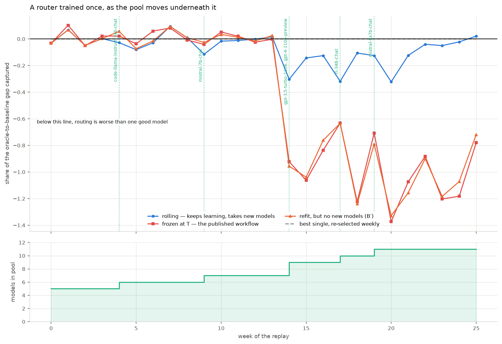

*The clearest chart in the repository. The cliff at week 14 is GPT-4 Turbo and GPT-3.5
Turbo arriving in the pool. **Red** (frozen) falls off it and never recovers. **Blue**
(rolling) absorbs the new models and returns to zero. The line that settles the argument is
**orange** — a router that refits every week on fresh data but is never allowed to add new
models. It tracks the frozen router almost exactly. Fresh data on the models you already
have is worth nearly nothing; access to the models that just shipped is worth everything.*

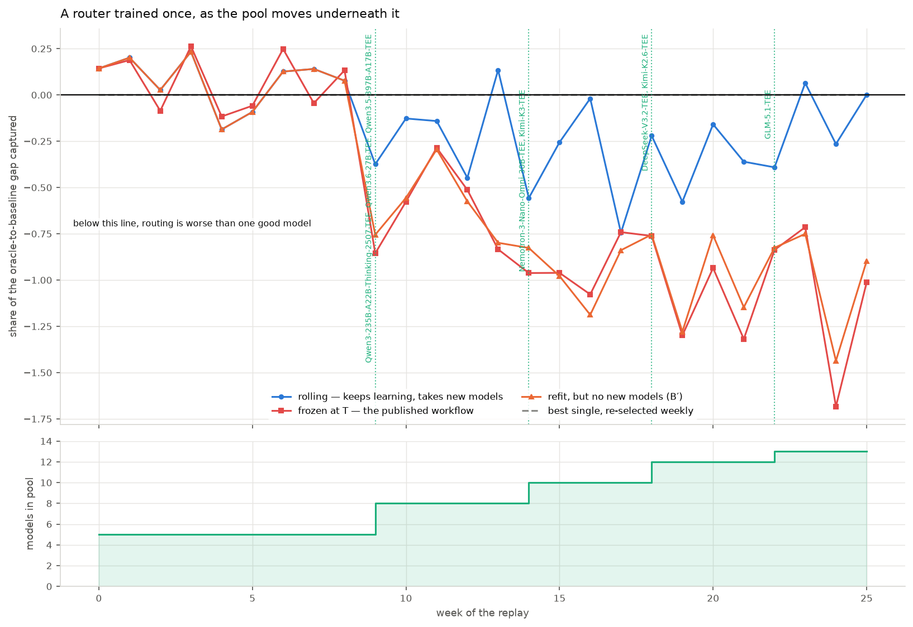

*The same experiment on the models the product actually serves. **Red** is a router built
once in May 2025; **blue** keeps testing. The vertical markers are real release dates —
the July cluster (three Qwen models) is where the frozen router falls off. **Orange** is
the arm that settles it: refits weekly on fresh data, never allowed to add a new model. It
tracks the frozen one. Fresh data on models you already have is worth 7%; access to the
models that just shipped is worth 93%.*

That last line is the commercially important one, and it inverts the priority the source
documents assume: the expensive thing is pool coverage and onboarding, not evaluation
freshness.

**And onboarding has a measured price.** Leave-one-model-out across all 13 slots: four have
a material gap when introduced cold, and for those the informative prior (§8.6) makes them
selectable after about **1,000 probe items**, where a cold column with no prior never
becomes selectable inside the grid at all. So "a new model ships" costs roughly 1,000
graded questions before the router can use it — which is the number that sets the
evaluation budget, and the reason §3.2's 93% is expensive to capture rather than free.

### 3.3 Price reactivity — the part that is architecture, not training

Price is read from the live Chutes list at decision time and never enters the fit, so a
price change reaches routing with no refit. Tested rather than asserted: the fitted weights
are hashed either side and are byte-identical at every point.

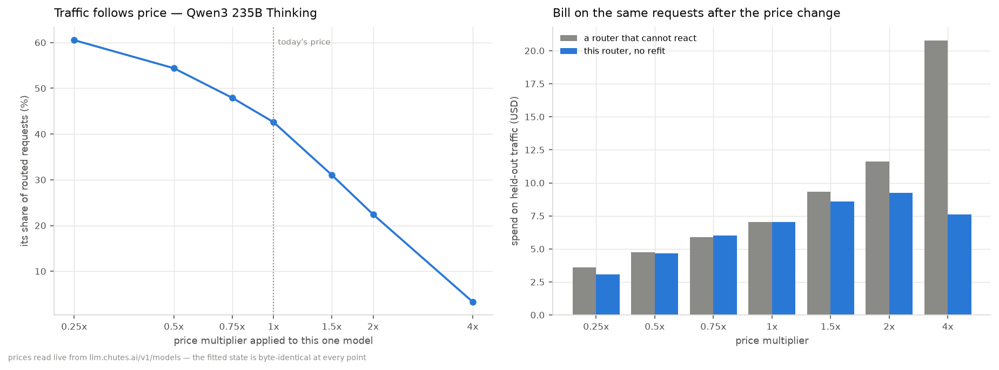

*Left: move one model's price and its share of traffic follows, smoothly and immediately.
Right: the bill on the same requests. **Grey** is a router that cannot react; **blue** is
this one. At 4× the price, reacting holds the bill at **$7.61 against $20.75** — a 63%
saving from a lane that costs nothing to update, on a model nobody retrained.*

---

## 4. Five things that had to be corrected first

Each of these was wrong at some point in this work, and each is now pinned by a test.

**1. The inherited operating point was worse than doing nothing.** λ_c = 0.05 is calibrated
on RouterBench; carried over unexamined it spends **84% more** than sending everything to
the best single model, for less quality. λ_c weights a cost *ratio*, and this pool's ratios
span three orders of magnitude where RouterBench's span one. Calibration is now a pipeline
stage. → `04_calibration.json`

**2. Uneven coverage made the router worse — and it is the coverage, not the volume.**
Training on all 23,795 graded items instead of the 2,302 fully-observed ones costs **twelve
points** of quality retention and 24% of the Brier score. Columns graded on different task
mixes have weights fitted over different regions of feature space and stop being comparable
at the argmax.

*Corrected framing.* This was originally reported as "ten times more training data made the
router worse", which cannot distinguish the coverage from the volume — the union arm has
both. A third arm holds the volume fixed, training on the same unevenly covered items cut
to the dense arm's 2,302: it retains **85.9%**, so the gap is **+14.5 points at equal n**,
*larger* than with ten times the data. More data was partly compensating for the damage,
not causing it. `PUBLISHING.md` §1 runs this on two further pools and shows the effect can
be dialled up and down by manipulating nothing but the observation mask.
→ `03_ablation.json`

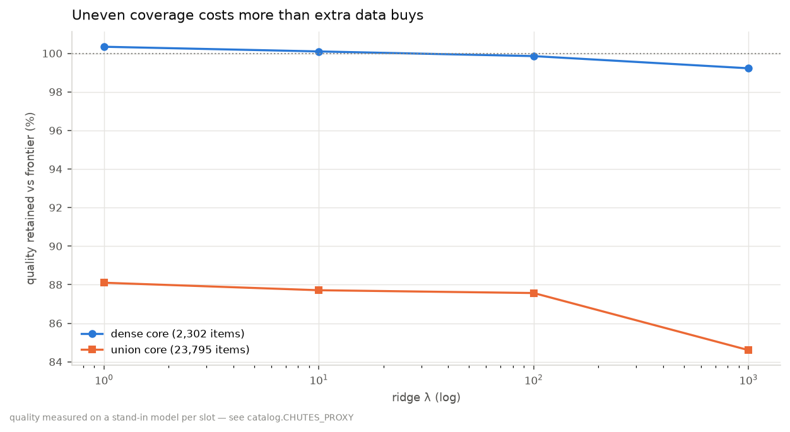

*Same held-out items in both arms; only the training set differs. The **orange** arm has
ten times the data and loses to the **blue** one at every regularisation strength. More
data is a liability when its coverage is uneven across the columns you are comparing —
and the size-matched third arm in `03_ablation.json` shows it is the unevenness doing the
damage, not the size.*

**3. 470 "measurements" were failed calls.** Zero tokens in, zero out, score exactly 0.0
where every other cell averages 0.60. Left in, the cost lane learns the model was free; on
the two items where the *reference* model failed, c_ref lands in a denominator and mean
utility goes to −439,045. Now marked unobserved.

**4. Ranking candidate models on their own coverage is a trap, twice.** Scored that way, a
9B open model appears to beat gemini-2.5-pro — purely because it was asked easier
questions. Every cross-model comparison in the code now runs on a shared item set.

**5. Prediction loss is the wrong thing to size the model by.** Validation Brier is still
falling at d = 64 while realised savings peak at **d = 28**. Sizing on the loss curve ships
a five-times-larger artifact that routes slightly worse. → `09_scaling.json`

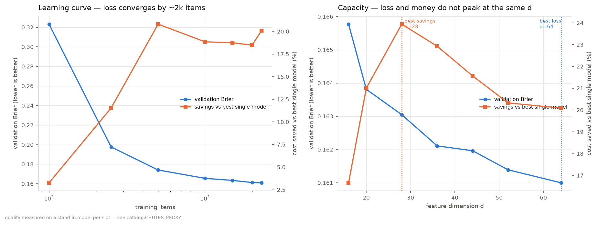

*Left: the learning curve converges by roughly **2,000 graded items** — which is the number
that matters operationally, because it sets how much probing a new model needs before it
can be trusted. Right: **blue** (loss) and **orange** (money) do not peak at the same
capacity. The dotted lines are 36 KB apart in artifact size and point in opposite
directions.*

---

## 4b. The two slots that never win — not dominated, unreachable

Earlier drafts of this document proposed retiring Mistral Nemo Instruct and Gemma 4 31B
Turbo because they take 0% of traffic at every λ_c. That was wrong, and the measurement
that shows it is the most useful single number in this file.

**A per-item oracle sends those two slots 30.8% of all traffic** — 22.2% and 8.6%. They
are not dominated. They are correct far more often than their averages suggest, on the
easy end of the workload, and the router cannot find those items.

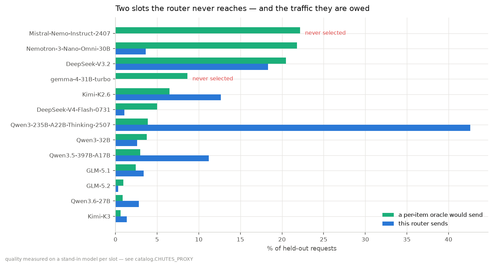

*Green is what a per-item oracle would send each slot; blue is what the router sends. The
two red labels are the slots that get nothing. The gap on the top row is the single
largest piece of unclaimed value in the pool.*

### Why the router cannot reach them

Measured, not guessed. Under the §8.7 argmax a model wins only by scoring highest, so:

| | Mistral Nemo | Qwen3 235B Thinking |
|---|---|---|
| predicted quality, mean | 0.215 | 0.830 |
| predicted quality, per-item spread (σ) | 0.160 | 0.078 |

The gap between the means is **0.615**; the per-item spread is **0.160**. For the cheap
model to win an argmax its prediction would need a roughly four-sigma excursion, which
never happens. Pushing λ_c until cost alone forces the issue does select them — at λ_c=25
they take 58% of traffic — but quality has collapsed to 0.426 by then. There is no setting
of the existing rule that puts them in the game at acceptable quality.

### The rule the product advertises does not fix it either

The product promises "the cheapest model that will get this question right", which is a
*threshold* rule, not an argmax — and a threshold rule can pick a cheap model whenever it
is good enough, regardless of what the strongest model would score. That should be exactly
the fix, so it was implemented (`chutes.sufficiency_policy`) and swept.

It loses at every matched quality level:

| rule | quality vs best single | cheaper by | open-tier share |
|---|---|---|---|
| argmax (§8.7, current) | 99.4% | **+20.1%** | 7.3% |
| threshold τ=0.85 | 98.7% | −78.7% | 6.6% |
| threshold τ=0.70 | 93.3% | +57.8% | 15.5% |
| threshold τ=0.50 | 80.5% | +78.0% | 42.0% |

The threshold rule *does* put the cheap models to work — 42% of traffic on the open tier at
τ=0.50 — but only by accepting answers that are wrong. The reason is precise and it is the
same finding as §4.5 seen from the other side: **an argmax needs only the ordering between
models to be right; a threshold needs the level to be right.** The level is what is badly
estimated here (Brier skill +0.257), so a rule that depends on it underperforms one that
does not.

**Conclusion: keep both slots, do not retire them, and stop trying to reach them with a
better decision rule.** They are worth 30.8% of traffic and the blocker is calibration of
the per-item quality estimate — which is §8.2's job, and now has a number attached to it.

---

## 4c. Latency — what the corpus supports, and what it does not

Asked for p95 and p99, and the honest answer has two halves.

**Per-request latency is not measurable from this data.** The corpus publishes wall-clock
per *run* — one `time_taken` for a whole file of a few hundred items — never per record.
The obvious fix is to fit `time = counts·overhead + tokens/throughput` per model and read
per-item latency off the measured token count. That was implemented, and then checked:

- **26 of 38 models** fit above 500 tokens/second, one at **10,810 tok/s**. Single-stream
  decoding for models this size is tens of tokens per second.
- **22 of 38 fits** have R² below 0.3; several are negative.

Both say the same thing: the runs were executed concurrently, so wall-clock measures the
harness's aggregate throughput, not the latency of any request. Dividing it by `counts`
gives a number with units of seconds that is not a latency. That check is kept in the code
(`latency.throughput_is_credible`) rather than the result being quietly shipped.

**What is measured, per item, is output tokens** — and within a model that is what decides
how long a request takes. So latency is routed on in token units, which is exactly measured
rather than roughly invented.

| | p50 | p95 | p99 |
|---|---|---|---|
| routed traffic, latency term off | 1,752 tok | **18,195 tok** | 28,857 tok |
| routed traffic, λ_l = 0.1 | 740 tok | **8,671 tok** | 22,633 tok |
| routed traffic, λ_l = 0.4 | 624 tok | **2,976 tok** | 5,302 tok |
| fastest slot (Gemma 4 31B) | 323 tok | 811 tok | 1,252 tok |
| slowest slot (Nemotron 3 Nano) | 2,558 tok | 31,809 tok | 32,400 tok |

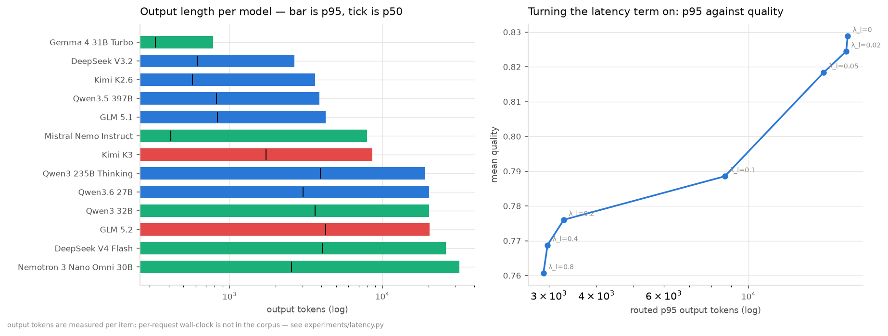

*Left: output length per slot — bar is p95, tick is p50. The spread within a model is 3× to
25×, which is where tail latency comes from. Right: switching §8.7's latency term on for
the first time.*

**The latency term is close to free, and this is the most under-priced knob in the system.**
Turning it to λ_l = 0.1 cuts routed p95 by **52%** and simultaneously raises savings from
79.7% to 83.9%, for 0.04 of quality — because a shorter answer is both faster and cheaper,
so the two objectives point the same way rather than trading off. Nothing in the source
documents anticipates that.

The one thing this cannot see is queueing, cold starts and load — which is what a real p99
is largely made of. One timed run against the endpoint replaces the whole section.

**That run now has a harness, and it is the cheapest open item in the package.**
`scripts/measure_latency.py` probes each reachable slot at **concurrency 1** — measuring
under parallelism is the exact defect that makes this corpus's wall-clock unusable — and
streams the response so time-to-first-token and decode rate are separated rather than
folded into one number. TTFT is regressed on input tokens, because prefill is linear in
prompt length and a mean TTFT is only valid for the prompt mix that produced it. Load is a
separate, labelled arm (`--load 1,2,4,8`), never averaged into the single-stream figure.
It applies `latency.throughput_is_credible` to its own output, so a probe that was not
actually isolated fails the same gate the corpus failed rather than shipping. Planned cost:
**144 calls, about $1.**

```bash
make latency-plan                   # free and offline: what a real run would cost
FIREWORKS_API_KEY=... make latency  # the run, then the analysis
```

Until then this section stands as written, in tokens. A dry run exists for exercising the
code path and every record it produces is stamped `synthetic`, so it cannot be mistaken
for a measurement — see `PUBLISHING.md` §6.

---

## 5. How this is getting better

For a technical reader the trajectory matters more than any single number, because it says
whether the next month of work will produce more of the same. Each correction below was
found by the same method — measure the thing the document asserts, rather than inherit it —
and each moved a number that the product is priced on.

| what changed | metric | before | after |
|---|---|---|---|
| Calibrated λ_c on this pool instead of inheriting it | savings vs best single | **−84.1%** (spending more) | **+20.1%** |
| Trained on shared-coverage items only | quality retained | 88.1% | **100.3%** |
| " | validation Brier | 0.2114 | **0.1610** |
| Removed failed calls from the label matrix | mean utility | −439,045 | **0.806** |
| Widened the feature hash 512 → 4,096 *(RouterBench)* | attainable gap captured | +0.589 | **+0.836** |
| Per-model Gram instead of the shared one *(RouterBench)* | utility under uneven coverage | −0.058 | **0** |

Two things are worth drawing out of that table.

**None of these came from a bigger model.** The estimator is the same closed-form ridge
regression throughout — 36 KB, sub-second fit, no GPU. Every gain came from fixing what the
data meant, not from capacity. That is the cheap kind of progress and there is more of it
left.

**Each one is now a test.** `test_inherited_operating_point_is_wrong_on_this_pool`,
`test_uneven_coverage_costs_more_than_extra_data_buys`,
`test_candidate_models_are_ranked_on_a_shared_task_set` and
`test_loss_and_money_do_not_peak_at_the_same_capacity` all fail loudly if a future change
quietly reintroduces the bug. 56 tests, each pinning a property some claim depends on. The
regressions we already paid for cannot come back for free.

---

## 6. How close is this to the final result?

Honest scoring of each piece against "could a customer rely on this".

| piece | state | what is missing |
|---|---|---|
| Router engine (closed-form, rank-one updates) | **Done** | nothing — 36 KB artifact, sub-second fit |
| Live price lane (FR-16) | **Done** | nothing — reads the public endpoint, verified no-refit |
| Staleness / decay evidence | **Done** | nothing for the claim as stated |
| Cost/quality frontier + calibration | **Done** | nothing for this pool |
| Loss & capacity sizing | **Done** | nothing |
| **Quality labels for the 13 Chutes models** | **Proxy** | the one real gap — see §7 |
| Per-item quality prediction | **Weak** | captures 85.2% of the oracle; this is the ceiling |
| Staleness / cold start on the current pool | **Done** | replicated; see 3.2 |
| Latency routing | **Partial** | routes on measured output tokens; no timed endpoint yet |
| The two never-selected slots | **Diagnosed** | worth 30.8%; blocked on prediction, see 4b |
| Online learning in production | **Not started** | needs live traffic |

**Roughly: the engine is finished, the evidence is real, and the labels are borrowed.**

---

## 7. The one real gap: the labels are proxy-backed

No public benchmark grades the Chutes checkpoints, and the `CHUTES_API_KEY` in
`.env.local` is empty, so nothing in this repository has measured a Chutes endpoint. Each
of the 13 slots is bound to a model LLMRouterBench *did* grade, and the router is trained
on that column's real per-item outcomes.

What is real and what is assumed:

- **Real:** quality and output-token counts, per item, from the corpus's own graders.
- **Real:** prices — the live Chutes list, verified in sync.
- **Real:** cost per cell = measured tokens × published Chutes price.
- **Assumed:** that each Chutes model behaves like its stand-in.

Quality of the bindings: **1 identical checkpoint** (Qwen3 235B Thinking), **9 same-family**,
**3 capability-matched only**. **11 of 13 are open-weights models**, like the pool itself.

### Why two slots lean on closed-weight models

The frontier slots (GLM 5.2, Kimi K3) are anchored to gemini-2.5-pro and gpt-5. This was
tested rather than assumed — `chutes.open_weights_only()` rebinds them to the strongest
unused open models and reports the result:

| slot | closed anchor | score | best open substitute | score |
|---|---|---|---|---|
| GLM 5.2 | gemini-2.5-pro | 0.816 | deepseek-r1-0528 | 0.780 |
| Kimi K3 | gpt-5 | 0.825 | deepseek-v3-0324 | 0.702 |

With open substitutes the frontier tier falls to 0.774 and 0.686, **below the best
mid-tier model at 0.831** — so the frontier tier stops being a frontier tier and becomes
two dominated columns nobody is ever routed to. The corpus grades no open model strong
enough to sit above the mid tier. The anchors stay, and are labelled everywhere.

### What closes this gap

One graded run against the real endpoint. ~2,000 questions is enough — that is where the
learning curve flattens — across the 13 models, on public benchmark items with known
answers. The bindings live in one table and everything downstream reads through it.

Until then, every artifact carries `proxy_backed: true` and every figure carries the
caveat in its footer.

### 7b. Part of it is now closed — and the assumption was worse than advertised

**Four of the thirteen slots have been graded on the real checkpoints.** Full method and
caveats in `GRADED_RUN.md`; the short version is that three claims made above are wrong.

Fireworks serves the same open-weights checkpoints, so four slots could be measured
directly — DeepSeek V4 Flash, Kimi K2.6, GLM 5.2 and Kimi K3. The other nine, including
all five Qwen slots, are not available serverless anywhere we hold a key, so they remain
proxy-backed. 55 items, paired against the same items the stand-ins answered.

**Correction 1 — "estimated cost is in the tens of dollars" was low by an order of
magnitude.** Measured from the corpus's own token counts at live prices, grading 2,000
items × 13 models costs **~$256**, and the full dense core **~$504**, before the
Arena-Hard judge (another $51–544) that the estimate omitted entirely.

**Correction 2 — "no code change" was wrong.** Nothing in this package could *produce* a
graded matrix: there was no chat client and no grader, and the 1.28 GB corpus archive
contains zero `.py` files, so every grader had to be reimplemented and calibrated (99.95%
agreement against 13,312 already-graded records).

**Correction 3 — the bindings are wrong in the place nobody was checking.** Quality was
roughly right; two of four errors resolve, both understating the real model:

| slot | stood in by | proxy | real | error (95% CI) |
|---|---|---|---|---|
| DeepSeek V4 Flash | DeepSeek-R1-0528-Qwen3-8B | 0.818 | 0.818 | +0.000 [−0.091, +0.091] |
| Kimi K2.6 | kimi-k2-0905 | 0.782 | 0.891 | **−0.109** [−0.200, −0.036] |
| Kimi K3 | gpt-5 | 0.891 | 0.873 | +0.018 [−0.054, +0.091] |
| GLM 5.2 | gemini-2.5-pro | 0.727 | 0.891 | **−0.164** [−0.255, −0.073] |

But **token counts are wrong by up to 4×**, and cost is tokens × price:

| slot | proxy tokens/call | real tokens/call | ratio |
|---|---|---|---|
| DeepSeek V4 Flash | 6,063 | 1,527 | **0.25×** |
| Kimi K2.6 | 1,214 | 4,212 | **3.47×** |
| GLM 5.2 | 5,350 | 3,535 | 0.66× |
| Kimi K3 | 1,456 | 1,114 | 0.77× |

The table above says quality and output-token counts are equally "real". They are equally
*measured*, but only of the stand-in — and the stand-in was chosen for capability, which
is the axis it got right. Nobody checked verbosity, and verbosity is what the bill is made
of.

**What that does to the shipped router.** Fitted on stand-in data with every graded item
held out, then scored against what really happened on those 55 items: the routing
decisions are unchanged (quality 0.8545 either way) but the realised bill is **28.6%
higher than predicted**. Only 22% of traffic reaches a measured slot, so that is a floor,
not an estimate.

The §7 framing — one assumption, closable for tens of dollars — understated both the cost
and the consequences. The consequence is not mainly in the quality lane. It is in the cost
lane, which is the one the product sells.

---

## 8. What we do next, and what would prove it worked

Ordered by value per unit of work. Each has a number attached, because a roadmap without
a target is a wish list.

### 8.1 Replace the borrowed labels with measured ones — *the only assumption left*

Grade the 13 Chutes models directly on ~2,000 public benchmark items. Tens of dollars, one
afternoon, no code change. **Target: `proxy_backed` becomes `false` and every figure in this
document is a measurement of the product.** This is the highest-value item by a wide margin
because it converts the whole document from "if each model behaves like its stand-in" to a
statement about the thing being sold.

### 8.2 A real encoder — *where the remaining performance is*

The decision rule is not the bottleneck; the per-item quality prediction is. The router
scores 0.8289 against a per-item oracle's 0.9734, so it captures **85.2%** of what perfect
per-question knowledge would get. The current encoder is deliberately cheap — hashed
word and character n-grams, chosen on the source document's claim that encoder scale barely
moves routing accuracy. That claim was taken on trust and has never been tested here.

`FeatureMap` already accepts an `embed_fn`, so a sentence encoder drops in without touching
the estimator, the artifact format, or anything downstream. **Target: close half the
router-to-oracle gap, which would take quality from 0.829 to ~0.90 at unchanged cost.**

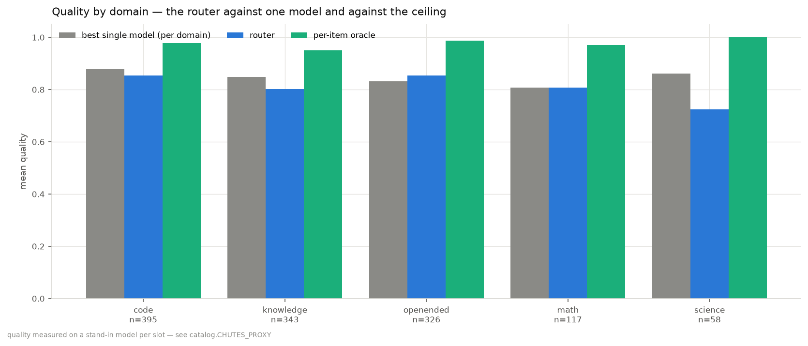

*Where the headroom actually is. Read the differences with their standard errors, because
only one of the five clears a corrected significance bar: knowledge **−0.047 ± 0.018 (2.6
SE)**, science **−0.138 ± 0.057 (2.4 SE, n = 58)**, open-ended **+0.023 ± 0.016 (1.4 SE)**,
code **−0.025 ± 0.021 (1.2 SE)**, maths **0.000 ± 0.032**. Run properly with Holm–Bonferroni across the family of five (`RIGOR.md` §2), **none of them
survives** — including knowledge at p = 0.0112 against a 0.0100 threshold. The router is
not established as better *or* worse than the best single model on any single domain. What *is* unambiguous is the **green** oracle bar at 0.95–1.00 everywhere — on science
it is 1.000, meaning some model in the pool answered every single question correctly and the
router failed to find it. That is a prediction problem, not a pool problem.*

### 8.3 Latency as a fourth routing axis

`p95` is the only invented column left anywhere in the product — no corpus we have records
per-item latency, so the website's figures are placeholders and marked as such in the code.
The router already accepts a latency term (`lam_latency`) that is switched off because
nothing has measured it. **Target: replace the placeholder column with measured p95 from
the same graded run as §8.1, and turn the term on.**

### 8.4 Release dates for the current pool

The staleness and cold-start results are measured on 2023 models because LLMRouterBench
publishes no release dates. Attaching public announcement dates to the current pool would
let the growing-pool replay and the leave-one-model-out cold-start study run where the
product actually lives. **Target: reproduce the 99/1 new-models-vs-fresh-data split on a
2025 pool, or find out it does not hold.**

### 8.5 Retire the two slots that never win

Mistral Nemo Instruct and Gemma 4 31B Turbo take 0% of traffic at every λ_c on the grid.

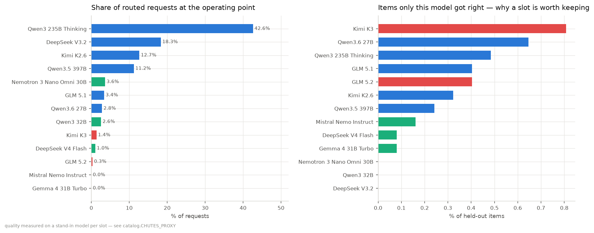

*Left: who actually gets the requests. Right: the share of held-out items each model was
the **only** one to answer correctly — the argument for keeping a slot at all. Kimi K3
takes 1.4% of traffic but is uniquely right on 0.8% of items, so it earns its place as a
specialist. The two models with no bar on the right and no bar on the left are the ones to
question.* **Target: either find the workload where they win, or drop them and save the
evaluation budget.**

### 8.6 Online learning on live traffic

Every routed request is another graded observation, and the estimator already absorbs them
as rank-one updates — there is no retraining job to build. What is missing is the traffic.
**Target: the first customer's requests measurably improving the policy, which is the point
at which the evidence base starts compounding and is the part a competitor cannot copy.**

---

## 9. Known limits, stated because they bound the conclusions

- **The bindings are the result.** Change one and the numbers move. The dominant-model
  finding is a joint property of measured stand-in quality and real Chutes prices.
- **3,541 items, 9 benchmarks**, all hard — AIME, GPQA, LiveCodeBench, MMLU-Pro,
  Arena-Hard. RouterBench's 36,497 are mostly multiple-choice, so difficulty and headroom
  are not comparable across the two halves of this repository.
- **Most per-domain differences are not significant.** Only one of five clears 2.6 SE, and
  with five comparisons that is exactly the corrected threshold. See `PUBLISHABILITY.md` §3.
- **Only 3 of ~20 headline numbers carry an error bar**; the rest are single measurements
  on a single split.
- **15 claims are adjudicated across the repository with no multiple-comparison
  correction**, so roughly one false positive is expected by construction.
- **The prediction is the ceiling, not the decision rule.** Brier skill +0.257, pairwise
  ranking concordance 0.826.
- **The Chutes pool's release dates are hand-entered** from public announcements, at
  month resolution. They can shift *when* a model joins the replay; they cannot change any
  model's quality or price.
- **Synthetic shocks** underlie every drift result; a static snapshot contains no real drift.
- **No per-request latency anywhere.** Routing uses measured output tokens as the signal;
  seconds appear only at a stated assumed decode rate, and queueing is invisible.

---

## 10. Conclusion — the three questions, answered with numbers

### "So it's like OpenRouter?"

No, and the difference is measurable. OpenRouter is a **gateway**: one API key, many
models, and *you* choose which one on every call. It solves reachability. We solve the
choice. Three numbers separate them.

**1. Picking the wrong single model costs 79.6%.** A gateway user picks a model and stays
there. Most pick the strongest — here that is GLM 5.2. On this pool the *optimal* single
pick is Qwen3 235B Thinking, which beats GLM 5.2 on quality **and** costs a quarter as
much. Simply knowing that is worth **79.6% ± 0.3% of spend at 97.8% of the quality**, and
a gateway cannot tell you it, because a gateway does not grade anything.

**2. Even a perfect single pick leaves 19.5% on the table.** Against Qwen3 235B Thinking —
the best choice a maximally diligent gateway user could make — per-request routing is
**19.5% ± 1.4% cheaper at 98.6% ± 0.4% of its quality**. That is the part that requires
routing rather than research.

**3. The right answer expires in nine weeks.** A model choice fixed in May 2025 decays
by **1.189** over 26 weeks and crosses below "no routing at all" at **week 9**. 93% of
that is new models arriving. On a gateway, keeping up is the customer's unpaid job, for
ever.

There is a fourth difference that is architectural rather than economic: our price lane is
read at decision time and never fitted, so a price change re-routes traffic with the model
byte-for-byte unchanged. In a measured shock, that absorbed **63%** of a 4× price rise
(bill held at $7.61 against $20.75). A gateway passes the new price through to you.

### "What is our promise?"

Stated as numbers a customer can hold us to, on the pool we serve:

| promise | measured |
|---|---|
| Same answers, materially cheaper | **19.5% ± 1.4% cheaper at 98.6% ± 0.4%** of the best single model's quality |
| Against what you are probably doing today | **79.6% ± 0.3% cheaper at 97.8% ± 0.4%** of the strongest model's quality |
| You control the trade | one dial, from 23% cheaper at 100.3% quality to 91% cheaper at 94.1% |
| Price cuts reach you immediately | no refit, no redeploy; 63% of a 4× shock absorbed |
| You do not go stale | a fixed choice decays 1.19 in 26 weeks; this does not |
| Faster, at no cost in money | routed p95 **−52%** while savings *rise* 79.7% → 83.9% |
| Small enough to run anywhere | 36 KB policy, closed-form fit, no GPU |

Two things we do **not** promise, and should not be asked to: that we beat the best
single model on *quality* (we do not — we match it), and any latency figure in seconds
(nothing here has timed a real endpoint).

### "Is this a feature or a product?"

The **routing rule is a feature.** It is a closed-form ridge regression and an argmax —
600 lines, a 36 KB artifact, and a competent engineer reproduces it in a week. Anyone
claiming that as a moat is selling the wrong thing.

**The product is the evidence, and the corrections that evidence forced.** Concretely,
what a competitor starting today does not have:

- **185,285 graded cells** over 13 models, and a pipeline that turns them into a policy in
  15 seconds.
- **A dial that is calibrated rather than inherited.** The published operating point is
  −84% on this pool and +20% after calibration. A competitor who copies the rule and the
  constant ships the −84% version and never knows.
- **Four corrections worth more than the rule itself**: coverage-matched training (+12
  points), failed-call removal, shared-task ranking, and capacity sized on money rather
  than loss. Each was found by measuring something a document asserted. None is guessable.
- **The knowledge that 30.8% of traffic is unreachable and why** — a number nobody gets
  without a per-item oracle to compare against.

And it compounds in a way a feature cannot: every routed request is another graded cell,
and cold start says a newly-shipped model needs about **1,000 probe items** before it is
usable. That is the moat — an incumbent with the evidence onboards a new model in a day;
a newcomer needs 1,000 graded questions per model before its router is even correct.

**The honest qualification**: today that moat is *borrowed*, not owned. The 185,285 cells
are stand-in measurements, not Chutes measurements. Until §8.1 is done the compounding
asset is a design, not a possession — which is exactly why it is the first item on the
roadmap and priced at tens of dollars.

---

## 11. Where each number lives

| claim | artifact | notebook |
|---|---|---|
| savings, both baselines | `chutes/11_crossval.json`, `chutes/06_policies.json` | 09 |
| calibration of λ_c | `chutes/04_calibration.json` | 09 |
| coverage ablation | `chutes/03_ablation.json` | 09 |
| loss & capacity curves | `chutes/09_scaling.json` | 09 |
| price reactivity | `chutes/10_prices.json` | 09 |
| binding audit / open-weights test | `chutes/01b_bindings.json` | 09 |
| staleness & decay (2023 pool) | `staleness.json` | 03, 07 |
| staleness & decay (current pool) | `chutes/13_staleness.json` | 09 |
| cold start / probes per new model | `chutes/14_coldstart.json` | 09 |
| the two never-selected slots | `chutes/12_slots.json` | 09 |
| latency signal and the λ_l sweep | `chutes/15_latency.json` | 09 |
| tie rate, pool description | `overview.json` | 01 |
| the website's figures | `src/lib/measured.ts` (generated) | — |
| error bars on every headline | `chutes/16_bootstrap.json`, `chutes/21_kfold.json` | 10 |
| per-domain SEs and the corrections | `chutes/17_domains.json`, `chutes/23_multiplicity.json` | 10 |
| coverage bias, made causal | `chutes/20_dose_response.json` | — |
| published-router baselines, with error bars | `chutes/19_baselines.json`, `chutes/22_baseline_margins.json` | 10 |
